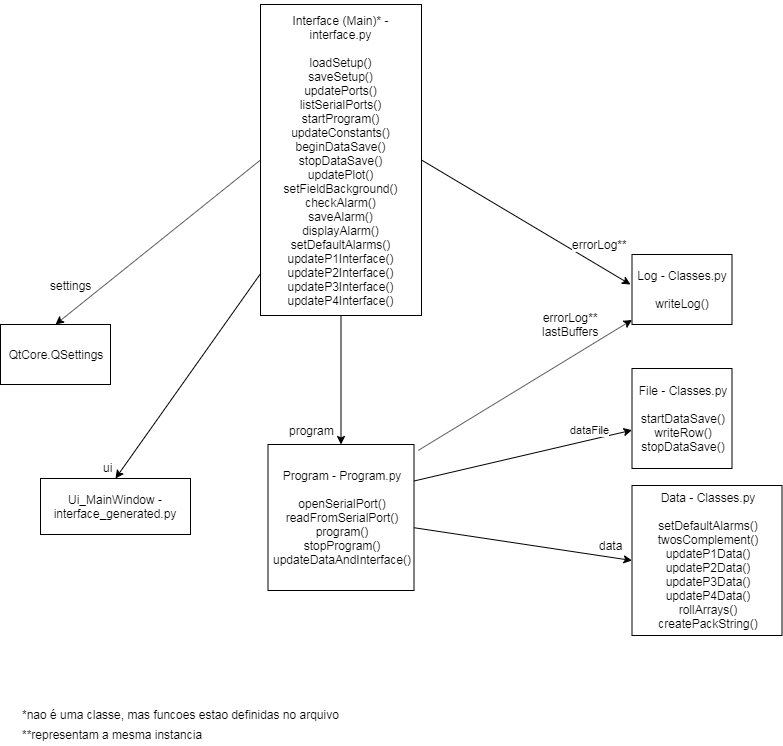

# Telemetria

# Dependencias

matplotlib - pip install matplotlib
numpy - pip install numpy
pyqt5-tools - pip install pyqt5-tools
PyQt5
pyqtgraph - pip install pyqtgraph

O pyqt5-tools instala também o Qt Designer, ferramenta utilizada para criar o visual da interface

# Modificando a interface

Para modificar algo na interface, altere o arquivo interface.ui, salve, e execute o seguinte comando:

pyuic5 -x interface.ui -o interface_generated.py

Após executar o comando, procure a linha <from pyqtgraph import PlotWidget>, no arquivo interface_generated.py,
(deve estar antes da declaracao <if __name__ == "__main__":>, no fim do arquivo), recorte ela e cole após a
declaracao <from PyQt5 import QtCore, QtGui, QtWidgets>, no inicio do arquivo. Isso deve ser feito após qualquer
alteracao no Qt Designer para que ela tenha efeito no codigo, de forma a evitar o erro no qual nao é reconhecido o modulo pyqtgraph.

# Classes

Ui_MainWindow - criada automaticamente executando a linha de comando vista acima, é responsavel por mostrar a interface. Os campos e mostradores sao acessados por meio de sua instancia única, <ui>, assim como os connects dos sinais (como aperto de botoes)

Log - Classe criada para facilitar escritas em campos com muito texto. Escreve mensagens na instancia logInstance, dada como parametro construtor. O texto escrito é mostrado primeiro, e os textos escritos anteriormente sao mostrados em seguida, todos separados por quebra de linha. A instancia logInstance é um campo da interface que aceite o método setText.

File - Facilita operacoes em arquivo. Já cria um arquivo com a hora e o minuto concatenado.

Data - Armazena os dados em um dicionario <dic>. O dicionario <dicRaw> armazena os mesmos dados, porém em sua versao "crua", sem nenhum processamento. O processamento do vetor <buffer> recebido é feito das funcoes updatePxData. Há também um dicionario que armazena os alarmes, na forma {chave: [valor, tipo]} (exemplo: {'ect':[95, greater than]}). Classe tambem armazena vetores dos dados que necessitam, como dados que vao ser plotados em graficos.

Program - Classe responsavel por executar o programa que le continuamente da porta serial e chama funcoes de atualizar os dados na classe Data e na interface.

Interface - Embora nao seja uma classe, todas as funcoes que mexem diretamente com campos da interface estao implementadas arquivo principal (main), que é executado. Isso inclui funcoes que atualizam campos e mostradores e funcoes que sao chamadas quando algum botao é pressionado.

settings - Instancia de QtCore.QSettings, com ela é possivel salvar no PC do usuário informacoes de campos editados na interface, e resgatá-los na proxima esecucao do programa.

